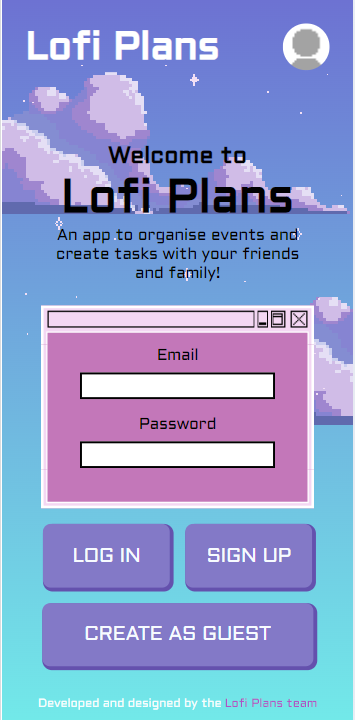

# Lofi Plans

# Deployed App

[Deployed version](https://lofi-notes-app.netlify.app/)

# Table of Contents
  - About
  - Functionality
  - Technologies Used
  - Setup/Installation
  - Approach and Coding Conventions Used
  - Status
  - Credits
  - Code Walkthrough

# About
Lofi Plans is an app that allows the users to create events to share with friends.
Once the event is created users can add tasks to the event. They can edit or delete them as they wish and toggle tasks as completed/pending.

Users can also edit their events after creation, changing the date and inviting friends to that event.

# Functionality

User lands in the HomePage:


User can then Sign up or log-in as guest. Please note that current server capacity only allows for 3 email requests per hour, so an error on signup may occur.
![CreateUser]<!-- (./src/assets/screenshots/homepage.png). -->
Once Signed up users will go to their User page:
![UserPage]<!-- (./src/assets/screenshots/homepage.png). -->
In User Page they can create new events, go to an existing event, or delete an old one.
Create Event is a Form where they can add date and guests
![CreateEvent]<!-- (./src/assets/screenshots/homepage.png). -->
After Submitting they will go to the Event Page, where they can add new tasks. Edit page can also be accesed from the User Page.
![EventDetails]<!-- (./src/assets/screenshots/homepage.png). -->
In case user wants to delete a Task or Event they will get a warning
![WarningExample]<!-- (./src/assets/screenshots/homepage.png). -->
In the Event they can add task or modify existing tasks, they can also edit the Event
![EventDetailEdit]<!-- (./src/assets/screenshots/homepage.png). -->
On Create & Edit events Users can search for their friends. Search functionality allows user to toggle several users and submit them if they are hidden

## Technologies Used
 - React
 - JS
 - CSS
 - HTML
 - Supabase
 - React Router Dom
 - Node

## Setup / Installation: 
- Fork the repository
- Clone the repository
- Instal the dependencies using npm install
- You need to create an account in Supabase in order for the project to run

## Approach and Coding Conventions used
  - Core Ap design is built in the Index.css, specially for colors 
    ### Routes

The Routes in the App work this way:

| Pages        | URL                             | Routes                         | Other Links        |
| ------------ | ------------------------------- | ------------------------------ | ------------------ |
| App          |                                 |                                |
| Home         | ./                              | CreateEvent                    | CreateUser         |
| CreateEvent  | ./users/:userId/events/create   | User Page                      |
| EventDetails | ./users/:userId/events/:eventId |                                | Add, Invite, Share |
| UserPage     | ./users/:userId                 | CreateEvent, EventDetails-List |
| CreateUser   | ./users/create                  |

|About

  ### Naming Conventions

The Naming Conventions in the App work this way:

| Name                    | Description    | Example                                                    |
| ----------------------- | -------------- | ---------------------------------------------------------- |
| Components              | `PascalCase`   | CreateEvent, EventDetails, UserPage, CreateUser, About     |
| Routes                  | `kebab-case  ` | create-event, event-details, user-page, create-user, about |
| Dynamic part of the URL | `camelCase`    | :userId, :eventId                                          |
| functions               | `camelCase`    | createEvent, eventDetails, userPage, createUser, about     |
| variables               | `camelCase`    | userName, eventName, eventDate, eventTime                  |
| css classes             | ` kebab-case`  | event-details, user-card, create-user, about               |

### Asynchronous Functions

We are handling asynchronous code with .then() and .catch() methods.

```javascript
function getUsers() {
  supabase
    .from("users")
    .select()
    .then((response) => {
      console.log(response.data);
    })
    .catch((error) => {
      console.error(error);
    });
}
```

## Status - Completed

## Credits - Aquiles, Kim, Marcel & Esteban

